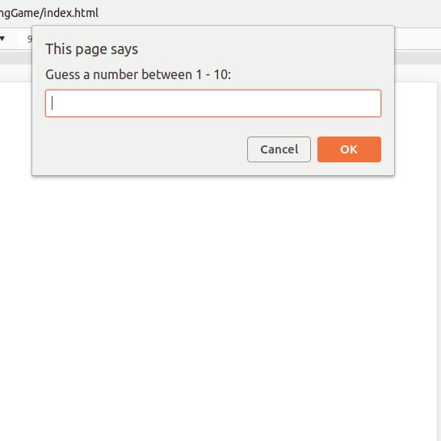

# The Guessing Game
## Create a guessing game for players. 

* Randomize a number between 1-10. Do not show the player.
* Make the player guess the number in a prompt.
 
* If the player guesses the correct number, print out whether the player was successful and in how many attempts (print in the console). 
 
* If the player is incorrect, change the text in the prompt to inform the player, e.g. "Nope, sorry! Try again!
 
* If the player fails to guess the number after three attempts, print out that the player was unsuccessful AND what the number was. e.g. "Sorry, you failed to guess the number in three attempts. The number was 0!"
 

**See the images for reference**
