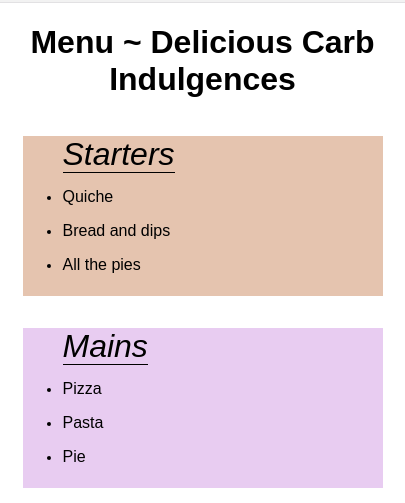

# Menu Styling 
In the repository, there is an `index.html` starting file which has the skeleton of an online menu. Style the menu by following the instructions below. 

**Rules**: 
* All changes to the menu should be done in JavaScript! No CSS!!
* The page should be responsive.

**Instructions**: 
* Change the font of the body element. 
* Center the text of h1 on the page.
* The menu headings have a class named `category`. Select the elements by class name. Then, change the `color` and `font-style` of each element. 
* Create a function named "_colorGenerator_" that returns a different color. The returned random color should also include set transparency. Select the unordered lists with the class of `food-category`. Give each list a different background color using the function that you created. 
* Align the `food-category` lists in a row on desktop. Make sure that the page is responsive and also works on mobile.
* Select the warning at the end of the page by its id `warning`. Select the id without using a querySelector. Change the size and font of the `warning`.
* Select all _even_ `allergy-info` items. Give the even items a different background color.
* Make the `allergy-warning` appear as a column in the center of the page.
* The descriptions in the footer should also be styled, e.g. a rounded border with a background color. They should appear in a column for mobile and in a row for desktop.

**Images**:

**Notes**:
* Follow the instructions to create a menu. You can add any additional styling. 
* Deadline: 2hrs.
* See reference images. 

