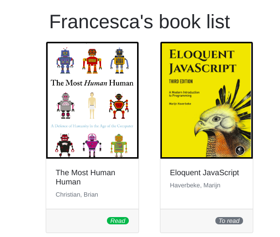

# To-Dos before

1. Revisit the presentation from today and try our the two exercises if you want more practice: https://www.teaching-materials.org/jsweb/slides/dom#/
2. Check out tutorials on DOM: https://www.youtube.com/watch?v=0ik6X4DJKCc
3. Finish previous exercise.

# The Book List
Create a personalized book website! Instead of adding all of the details of books in HTML, add data on the page from the `books` array in `index.js` using JavaScript.

## Book Details
Display the book details on the page, such as author's name, book title and reading status. The book cover should appear above the book details and the image should link to the URL of the book cover.

## Status
The styling of reading status should be updated depending on whether the book has been read - the bootstrap badge style should change as well as the text, which should appear as "Read".

## Order
The authors' last names should appear first e.g. "Smith, John". Furthermore, the books should be displayed on the page in alphabetical order according to the authors' last names.

**Images**:

**Notes**:
* Deadline: 2hrs.
* Work with the `index.html` and `index.js` files provided in this repository.
* Add bootstrap styling where necessary. See the reference images for result.

