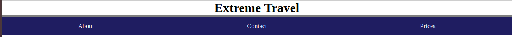
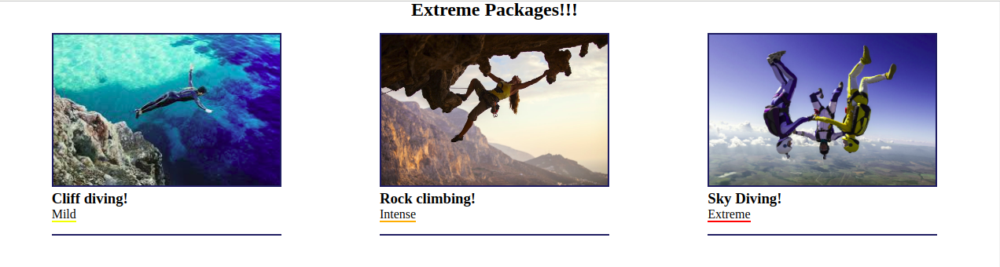

# Extreme Travel Website!

**Instructions**:
* Select the `header` that is the closest to the first `h1` heading. Give the `header` a solid border of 5px. 

* If the `.info` section contains an `.info-package`, select all `package-title`s and give the title's previous element a border. 

* Check if the label's class matches "mild". If so, give the label a yellow solid border. If the label's class matches "intense", give the label an orange solid border. If the class does not match either, give the label a red solid border. 

* Add all the children of the `.nav-list` to the footer's unordered list, `.site-map`. Note: the `.nav-list` should still contain its children. 

**Bonus**
After you completed the assignment and published the solution branch, you can create a new branch `feature/restyle` and change the design of the landing-page. You can publish it on GitHub Pages when you are satisfied with the result.

**Notes**:
* Deadline: ~2hrs.
* See images for reference.