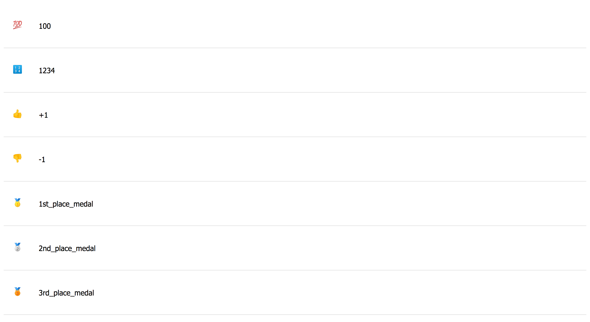

# Handlebars: Emojis list

> Make sure to include handlebars: `https://cdnjs.cloudflare.com/ajax/libs/handlebars.js/4.7.3/handlebars.js` into your `index.html`.

Create your custom JavaScript file and include it in the HTML.

Next, create a Handlebars template that displays each one of the emojis as image together with its key. Try to use appropriate HTML tags.

Take a look at the example image:

