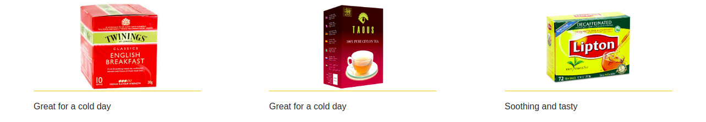

# jQuery Introduction 

Use jQuery to complete the tasks below for a custom tea shop! Feel free to use the following cheat sheet on a quick guide to the jQuery methods: https://oscarotero.com/jquery/

**Instructions**:
* Use the elements found in the `index.html` to display a modal if the user clicks "Submit" at the end of the form. The user should be able to exit the modal by clicking the `.close-modal` element or another part of the window. 

* If the user clicks the teapot image at the top of the page, the teapot should rotate by 20degrees. If the user clicks the teapot again, the image should pop back into place.

* If the user hovers over the `.tea-desc` nested in the `selection__option`s, the text should change to a random phrase, e.g. "Great tea for a cold night", "Rich in flavours" etc.

**Notes**: 
* Deadline: ~1hr
* See images for reference 
