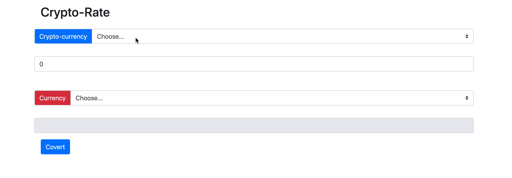

# Currency converter

## Description:

- The user will be able to select a crypto currency and input the price. 

- Then, the user will be able to convert the crypto currency into another selected currency e.g. USD/EUR etc. 

- The result will, then, be displayed to the user.

## Instructions for students:

Create a currency converter webpage. The page should convert the given currency to the chosen one. 
  
 - use exchange rates API [Cryptocurrencies](https://www.cryptonator.com/api)

Example once your program is running properly:

 
 

### Rules

-   This is an individual assignment.
-   Deadline: 3 hours.
