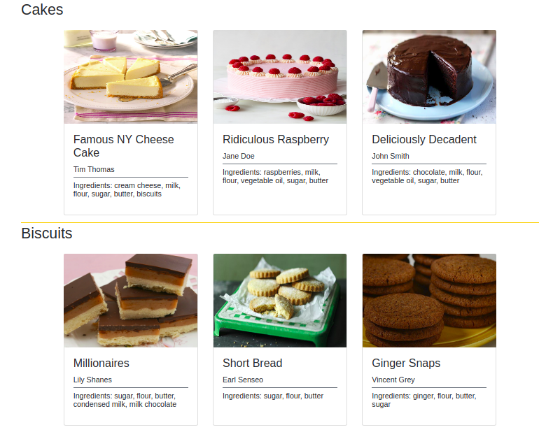

# Baking Box

Populate a website with details of recipes!

**Instructions**:
* In the `data.js` file, you can find a data structure for the details of recipes. 
* Export the data structure as a JSON string.
* Import the JSON string into the `index.js` file. 
* In the `index.js` file, create a program that populates the data from the JSON string onto the website page. The page should display every recipe as a card which includes  the recipe image, title, author and ingredients. 
* Make sure that each recipe is populated in the **correct** section, that is, cake recipes should be under the section "cakes" etc. 

