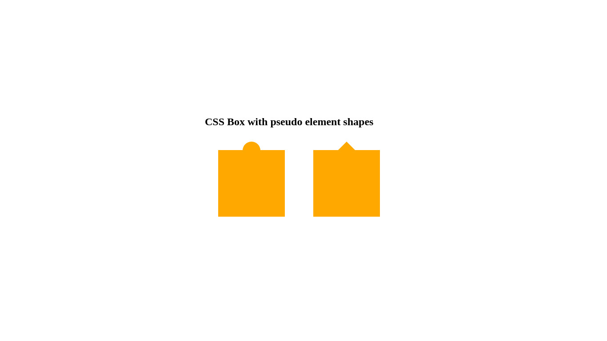

# Do have some fun with Pseudo Elements

**Instructions**: 

**Task** 
* Create two divs with the class `box`. 
* Add one more class to each div `with-circle` and `with-triangle`
* Use the css-pseudo elements `::before` and `::after` to create one circle and one triangle.
* Set position to abolute for circle and triangle and move them on the top of box as shown in reference image below.

