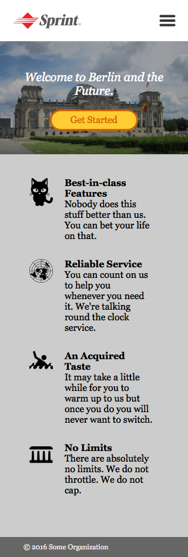

## Let's make a webpage!

The image assets you need to create the page below can be found in the <a href="assets">assets directory</a>.

## Working with the browser developer tools

As you check what your HTML looks like when the browser renders it, familiarize yourself with the browser's developer tools. They allow you to inspect your HTML and CSS and try out changes! If you're using Chrome, you can learn more about its dev tools [here](https://developers.google.com/web/tools/chrome-devtools/inspect-styles/?utm_source=dcc&utm_medium=redirect&utm_campaign=2016q3).

## BONUS: Part 2

As a next step let's make our webpage display nicely on phones.

**_NOTA BENE_**: Try do not use `display: flex` or `display: grid` for this project. We will discuss Flexbox and Grid in due course. For now, please stick to the techniques discussed [here](https://www.w3schools.com/css/css_positioning.asp).
