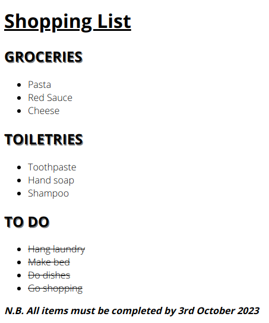

# Shopping List

**Instructions**:

-   Choose a font on google fonts. Select different font weights e.g. light, regular, bold. Apply the font to all the elements on the page.
-   Create a stylesheet and work from there.
-   Underline the h1 heading.
-   Give all list items a light font weight.
-   Give all headings with the class of `heading` a shadow and, in CSS, make all these elements appear uppercase.
-   Give the element with the class of `note` a bold font weight. Make the text appear italic.
-   Strike through all the elements with the class `todo-item`.

